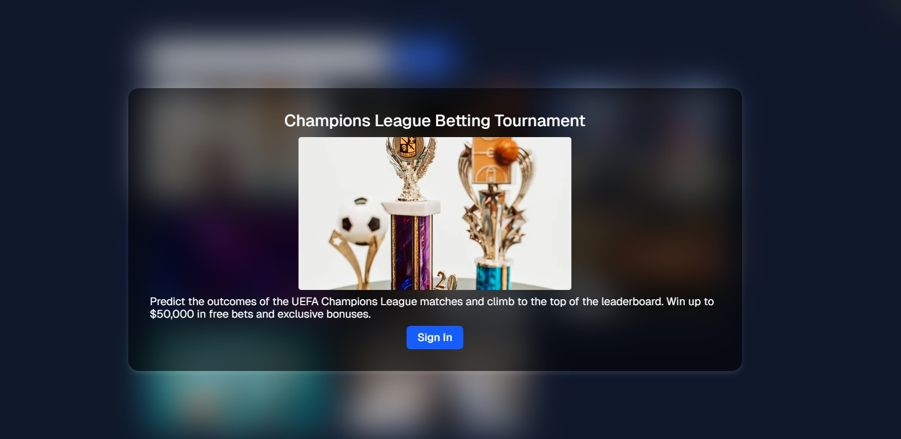

# Games Tournaments

Tournament listing feature built with Next.js 14 App Router, combining the power of Tailwind CSS and styled-components.
Includes a search system, skeleton loading states, modals for tournament details, and a full light/dark theme toggle.



## Technologies Used

- [Next.js 16](https://nextjs.org/docs/getting-started)
- [Tailwind CSS](https://tailwindcss.com/)
- [TypeScript](https://www.typescriptlang.org/)
- [Styled Components](https://styled-components.com/)

### Features

- Tournaments List Page
- Search Functionality
- Skeleton Loader
- Tournament Modal
- Join Simulation
- Dark / Light Theme Toggle

### Getting Started

1. **Clone the repository:**

   ```bash
   git clone https://github.com/AslanovRustam/games-tournament.git

   cd games-tournament

   npm i

   npm run dev
   ```

   Open http://localhost:3000 in your browser to see the result.
